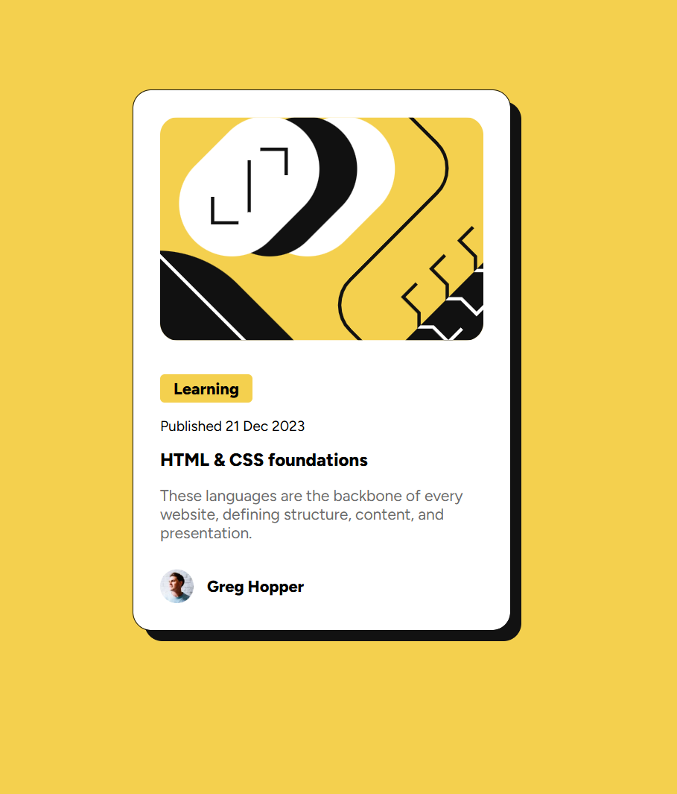

# Frontend Mentor - Blog preview card solution

This is a solution to the [Blog preview card challenge on Frontend Mentor](https://www.frontendmentor.io/challenges/blog-preview-card-ckPaj01IcS). Frontend Mentor challenges help you improve your coding skills by building realistic projects. 

## Table of contents

- [Overview](#overview)
  - [The challenge](#the-challenge)
  - [Screenshot](#screenshot)
  - [Links](#links)
- [My process](#my-process)
  - [Built with](#built-with)
  - [Continued development](#continued-development)
- [Author](#author)
- 

## Overview

### The challenge

Users should be able to:

- See hover and focus states for all interactive elements on the page

### Screenshot

### Links

- Solution URL:  (https://github.com/xluxeo/frontend-mentor/tree/main/02-blog-preview-card)
- Live Site URL: (https://frontend-mentor-blog-preview-card-omega.vercel.app/)

## My process

### Built with

- Semantic HTML5 markup
- CSS custom properties
- Flexbox
- CSS Grid
- Mobile-first workflow
- [Vite-TWIG](https://vituum.dev/plugins/twig) - TWIG plugin

### Continued development
- More Twig
- Implement JavaScript and SCSS

## Author

- Frontend Mentor - [@xluxeo](https://www.frontendmentor.io/profile/xluxeo)
